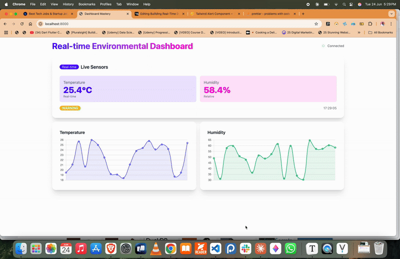

# Real-time Environmental Dashboard

> A modern, responsive web dashboard for monitoring environmental sensor data in real-time using FastAPI, HTMX, and Server-Sent Events (SSE).



## 🌟 Features

- **Real-time Data Streaming** - Live sensor updates via Server-Sent Events
- **Interactive Charts** - Temperature and humidity trend visualization with Chart.js
- **Responsive Design** - Mobile-first design with Tailwind CSS and DaisyUI
- **Status Monitoring** - Color-coded alerts for normal, warning, and critical states
- **Hot Reload** - Development mode with live code/template reloading
- **Health Monitoring** - Built-in health check endpoint

## 🚀 Quick Start

### Prerequisites

- Python 3.11+
- [uv](https://docs.astral.sh/uv/) (recommended) or pip

### Installation

1. **Clone the repository**
   ```bash
   git clone <repository-url>
   cd sensor-dashboard
   ```

2. **Install dependencies with uv**
   ```bash
   # Initialize project (if needed)
   uv init

   # Install dependencies
   uv sync
   ```

   Or with pip:
   ```bash
   pip install -r requirements.txt
   ```

3. **Run the application**
   ```bash
   # With uv
   uv run uvicorn app:app --reload --host 0.0.0.0 --port 8000
   
   # Or with uvicorn directly
   uvicorn app:app --reload --host 0.0.0.0 --port 8000
   ```

4. **Open your browser**
   ```
   http://localhost:8000
   ```

## 📁 Project Structure

```
environmental-dashboard/
├── app.py              # FastAPI application
├── utils.py            # Sensor data generator utility
├── templates/
│   ├── base.html       # Base template with layout
│   ├── index.html      # Main dashboard template
│   └── chart_data.html # Chart data template
├── pyproject.toml      # uv project configuration
├── requirements.txt    # Python dependencies (fallback)
└── README.md          # This file
```

## 🛠️ Technology Stack

- **Backend**: FastAPI, SSE-Starlette
- **Frontend**: HTMX, Chart.js, Tailwind CSS, DaisyUI
- **Real-time**: Server-Sent Events (SSE)
- **Development**: Arel (Hot Reload)

## 📊 API Endpoints

| Endpoint | Method | Description |
|----------|--------|-------------|
| `/` | GET | Main dashboard page |
| `/stream` | GET | SSE endpoint for real-time data |
| `/current` | GET | Get current sensor reading |
| `/chart-data` | GET | Chart data for visualizations |
| `/health` | GET | Health check endpoint |

## 🎯 Sensor Data Format

```json
{
  "timestamp": "2025-01-15T10:30:45.123456",
  "temperature": 22.5,
  "humidity": 45.2,
  "status": "normal"
}
```

**Status Values:**
- `normal` - All readings within acceptable range
- `warning` - Readings approaching limits
- `critical` - Readings outside safe parameters

## 🔧 Configuration

### Sensor Parameters (utils.py)
```python
class SensorData:
    def __init__(self):
        self.min_temp = 18.0      # Minimum temperature (°C)
        self.max_temp = 26.0      # Maximum temperature (°C)
        self.min_humidity = 30.0  # Minimum humidity (%)
        self.max_humidity = 65.0  # Maximum humidity (%)
```

### Development Mode
Set the `DEBUG` environment variable to enable hot reload:
```bash
export DEBUG=1
uv uvicorn app:app --reload
```

## 🎨 Dashboard Features

### Real-time Display
- Live temperature and humidity readings
- Color-coded status indicators
- Automatic connection status monitoring

### Interactive Charts
- Smooth line charts for temperature and humidity trends
- Last 20 readings displayed
- Auto-updating with new data

### Alert System
- Critical status alerts with auto-dismiss (10 seconds)
- Visual status badges
- Connection state indicators

## 🧪 Development

### Running in Development Mode
```bash
# With hot reload enabled using uv
DEBUG=1 uv run uvicorn app:app --reload --port 8000

# Or without uv
DEBUG=1 uvicorn app:app --reload --port 8000

# Production mode with uv
uv run uvicorn app:app --host 0.0.0.0 --port 8000
```

### Adding New Sensor Types
1. Extend the `SensorData` class in `utils.py`
2. Update the frontend template to display new data
3. Modify chart configurations as needed

## 📈 Performance

- **Data Storage**: In-memory deque with 20-item limit
- **Update Frequency**: 2-second intervals
- **Client Connections**: Supports multiple concurrent SSE connections
- **Memory Usage**: Minimal footprint with efficient data structures

## 🔒 Security Considerations

- Input validation on all endpoints
- CORS headers can be configured for production
- Environment-based configuration
- Graceful error handling for client disconnections

## 🐛 Troubleshooting

### Common Issues

**Charts not loading:**
- Check browser console for JavaScript errors
- Ensure Chart.js CDN is accessible
- Verify `/chart-data` endpoint is responding

**SSE connection fails:**
- Check network connectivity
- Verify FastAPI server is running
- Look for CORS issues in browser console

**Hot reload not working:**
- Ensure `DEBUG=1` environment variable is set
- Check that `arel` package is installed
- Verify file watching permissions

## 🤝 Contributing

1. Fork the repository
2. Create a feature branch (`git checkout -b feature/amazing-feature`)
3. Commit your changes (`git commit -m 'Add amazing feature'`)
4. Push to the branch (`git push origin feature/amazing-feature`)
5. Open a Pull Request

## 📄 License

This project is licensed under the MIT License - see the [LICENSE](LICENSE) file for details.

## 📞 Support

For questions or issues:
- Open an issue on GitHub
- Check the troubleshooting section above
- Review the API documentation

---

**Built with ❤️ using FastAPI, HTMX, and modern web technologies**